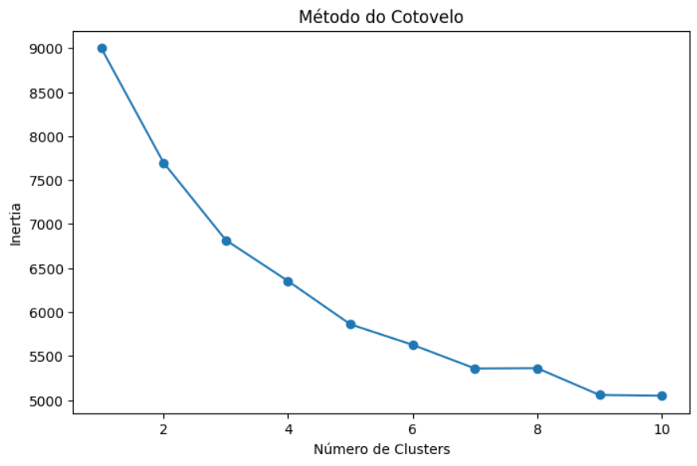
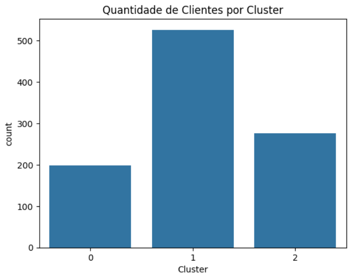
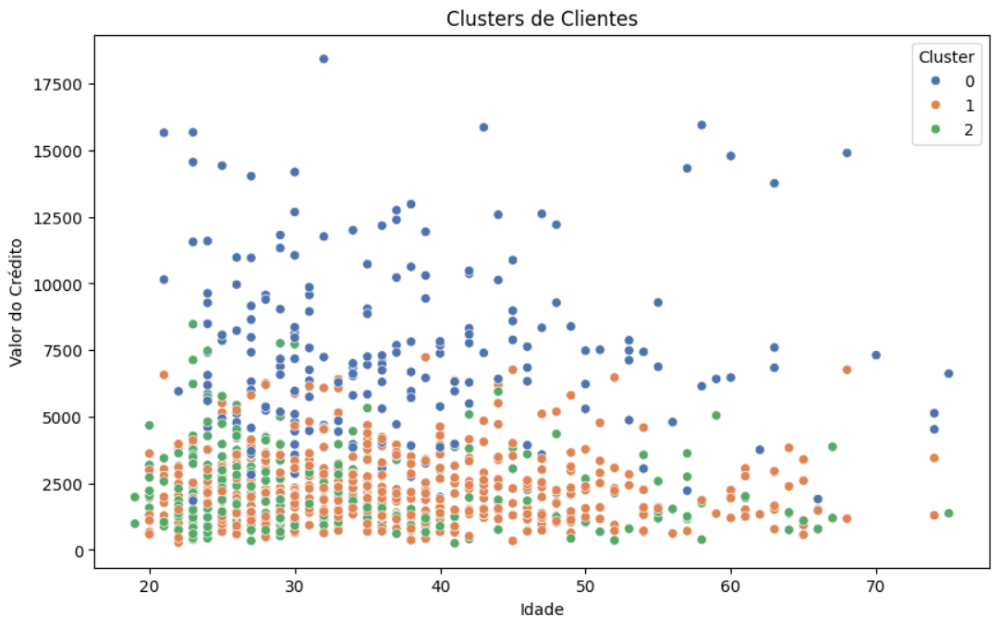
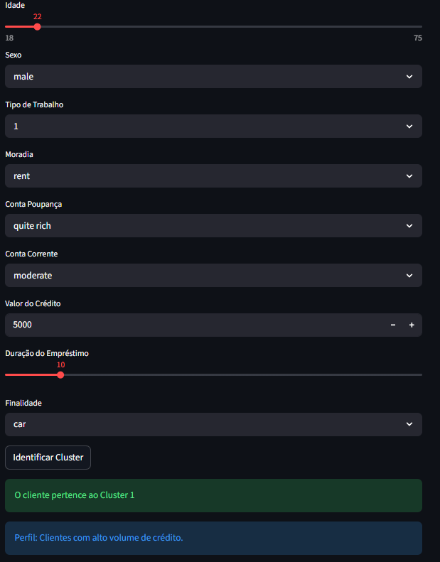

## Sobre o Projeto

Este projeto utiliza técnicas de Ciência de Dados e Machine Learning para realizar a segmentação de clientes bancários utilizando o algoritmo K-Means.

O objetivo é identificar padrões de comportamento financeiro e agrupar clientes com características semelhantes.

Além do modelo de Machine Learning, foi desenvolvida uma aplicação web interativa utilizando Streamlit.

---

# Tecnologias Utilizadas

- Python
- Pandas
- NumPy
- Scikit-Learn
- Matplotlib
- Seaborn
- Streamlit
- Joblib

---

# Dataset Utilizado

Foi utilizado o dataset German Credit Risk disponível no Kaggle.

O dataset contém informações como:

- idade;
- sexo;
- valor do crédito;
- duração do empréstimo;
- tipo de moradia;
- finalidade do crédito.

---

# Algoritmo Utilizado

O algoritmo utilizado foi o K-Means Clustering.

O número ideal de clusters foi definido utilizando o Método do Cotovelo (Elbow Method).

---

# Resultados

O modelo conseguiu identificar diferentes perfis de clientes bancários com base em características financeiras e demográficas.

Os clusters encontrados apresentaram diferenças relevantes entre:

- idade;
- valor de crédito;
- duração do empréstimo;
- perfil financeiro.

---

# Aplicação Web

A aplicação foi desenvolvida utilizando Streamlit.

O sistema permite:

- inserir dados de novos clientes;
- identificar automaticamente o cluster;
- visualizar o perfil financeiro correspondente.

---

# Como Executar o Projeto

## 1. Clonar o repositório

```bash
git clone URL_DO_REPOSITORIO
```

---

## 2. Instalar dependências

```bash
pip install -r requirements.txt
```

---

## 3. Executar aplicação

```bash
python -m streamlit run app/app.py
```

---

# Screenshots

## Método do Cotovelo



---

## Visualização dos Clusters





---

## Aplicação Streamlit


---

## Conclusão

O desenvolvimento deste projeto demonstrou a viabilidade da utilização de técnicas de Ciência de Dados e Machine Learning para segmentação de clientes bancários.

A aplicação do algoritmo K-Means permitiu identificar padrões relevantes entre os clientes da base de dados, agrupando indivíduos com características financeiras semelhantes. Esse tipo de análise possui grande aplicabilidade em instituições financeiras, especialmente em estratégias de marketing, análise de perfil de consumo e personalização de serviços.

Os resultados obtidos mostraram que a clusterização pode auxiliar empresas na tomada de decisões, permitindo compreender melhor o comportamento dos clientes e desenvolver abordagens mais eficientes para diferentes perfis financeiros.

A criação da aplicação web utilizando Streamlit tornou a solução prática e interativa, aproximando o projeto de cenários reais utilizados no mercado de tecnologia e análise de dados.

O projeto também evidenciou a importância das etapas de pré-processamento, normalização e tratamento de dados para o bom desempenho dos algoritmos de Machine Learning.

Portanto, conclui-se que a solução desenvolvida é viável, funcional e aplicável em contextos reais, demonstrando o potencial da Ciência de Dados como ferramenta estratégica para análise e segmentação de clientes.
---

# Autor

Igor Lins